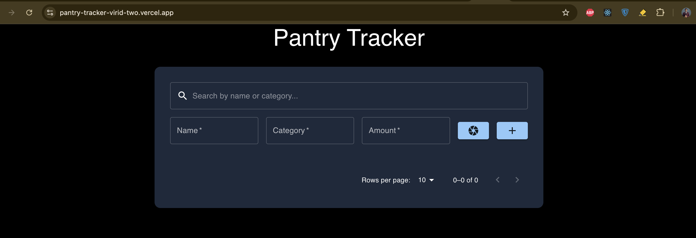

# Pantry Tracker

This is a [Next.js](https://nextjs.org/) project bootstrapped with [`create-next-app`](https://github.com/vercel/next.js/tree/canary/packages/create-next-app).

The project is a demo version of a pantry or inventory tracker. People can add, update, delete and search items in the inventory.
Besides manual intervention, this app supports automatic product add by **OpenAI VISION API** as well. Once the item is captured 
by the camera, the application sends the data to the Vision API to identify the item and it's count and put the values in respective form fields. Then, user 
can opt for either add the item or not.

## Tools Used
- **Firebase Cloud Store** to store the items
- **React Camera Pro** to scan the items
- **Algolia Search** for text based search
- **Next.js** for fullstack development
- **Open AI Vision API** to parse the image

## Getting Started

First, install the dependencies
```bash
npm install
```

Then, run the development server:
```bash
npm run dev
```

Open [http://localhost:3000](http://localhost:3000) with your browser to see the result.

You can start editing the page by modifying `app/page.tsx`. The page auto-updates as you edit the file.

This project uses [`next/font`](https://nextjs.org/docs/basic-features/font-optimization) to automatically optimize and load Inter, a custom Google Font.

## Deploy on Vercel

The app is deployed on vercel https://pantry-tracker-virid-two.vercel.app. Check it out.

## Demo
Check the demo. [](https://www.youtube.com/watch?v=zhoE1n_9urw).

